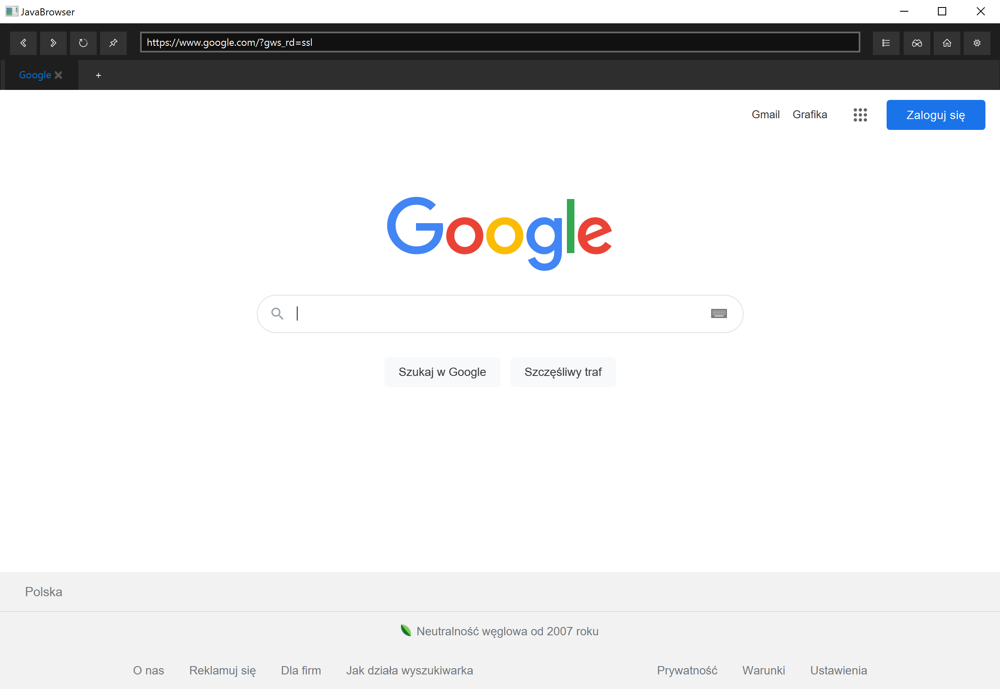
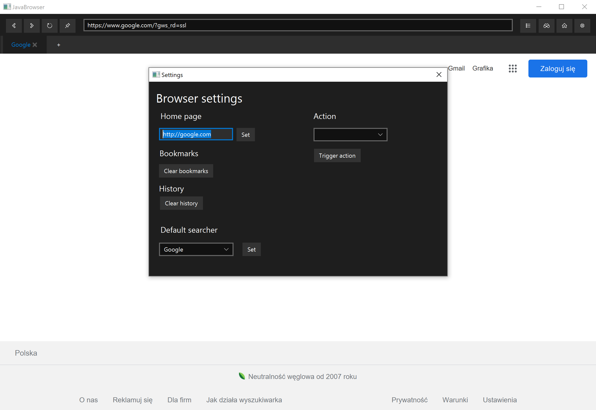

# JavaBrowser
Java browser built using JavaFX technology featuring:
- full navigation support (refeshing, going backward/forward, going to home page)
- bookmarks
- browsing history
- multipurpose address bar (with search support)
- automation macros

## Screenshots
Main window

Settings

## Resources
### Styles
JMetro - JavaFX theme inspired by Microsoft Fluent Design System (Windows 10)

https://github.com/JFXtras/jfxtras-styles

https://pixelduke.com/java-javafx-theme-jmetro/

### Icons
Ikonli Windows 10 icon pack

https://github.com/icons8/windows-10-icons

### Tools
Gson - Google's JSON serialization library

https://github.com/google/gson
